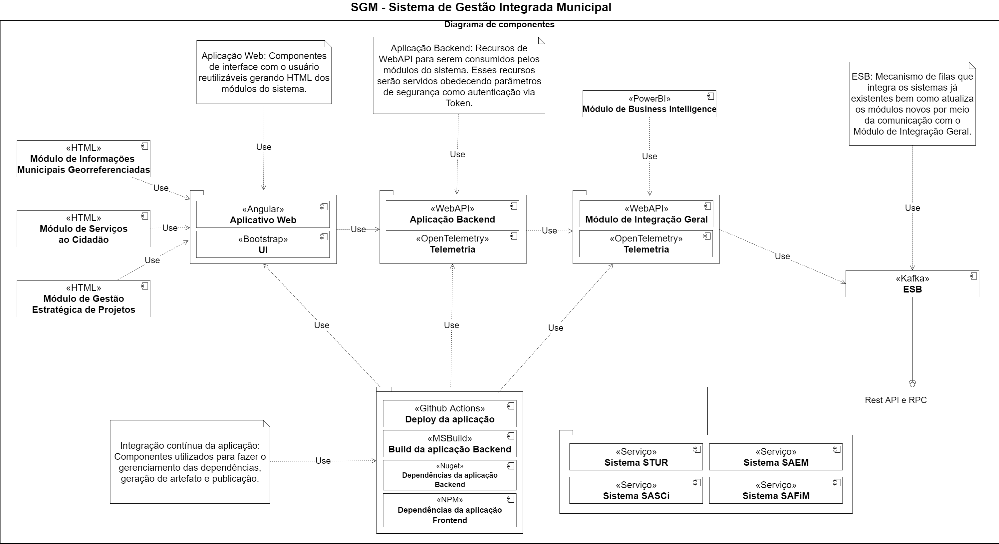
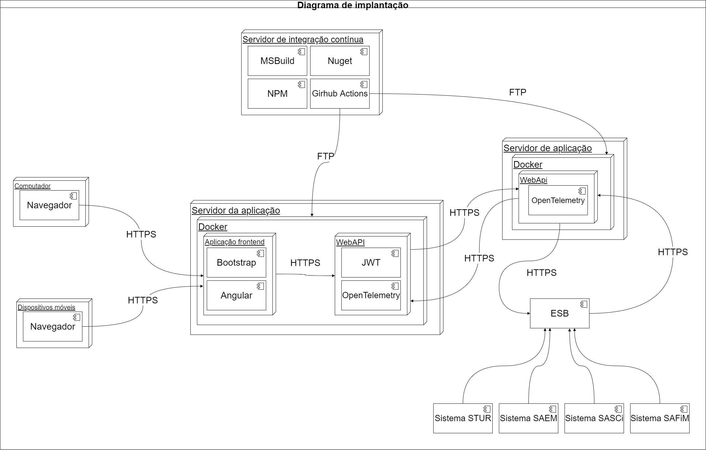
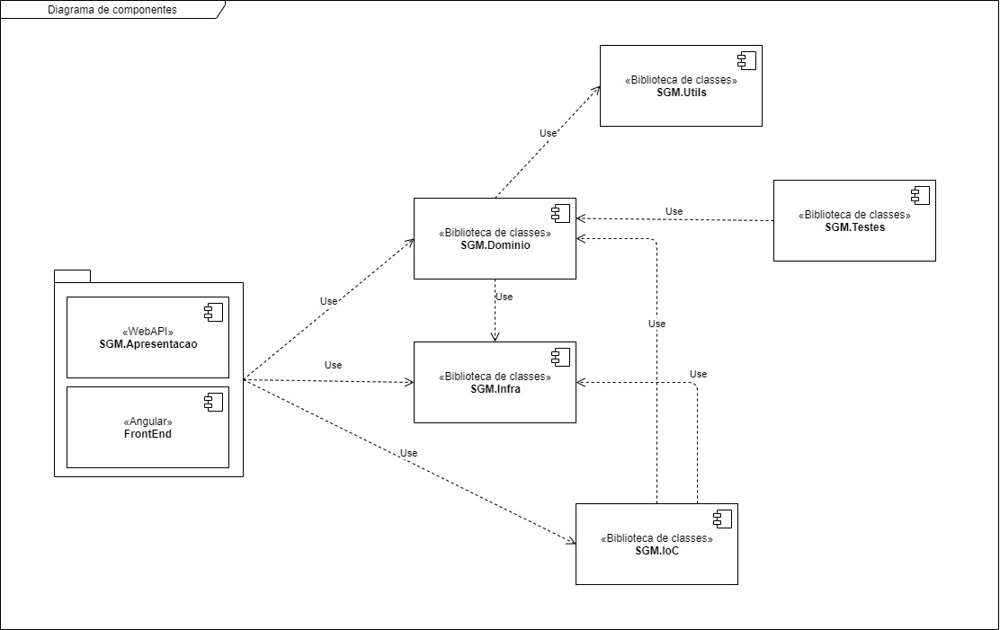
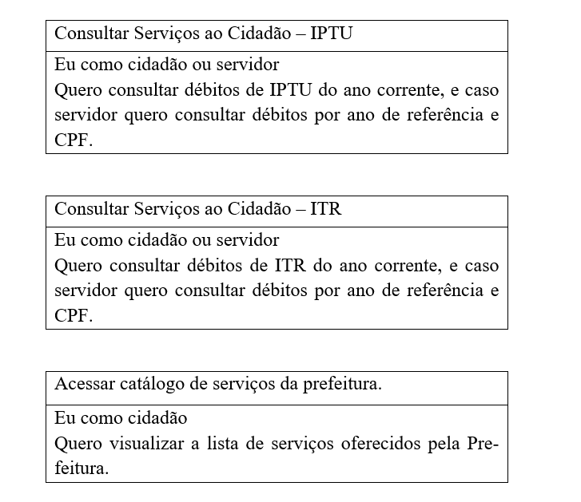

# Projeto da pós graduação em Arquitetura de Software Distribuído

Este repositório contém uma prova de conceito para o Trabalho de Conclusão da Pós-graduação de Arquitetura de Software Distribuído (PucMinas).

## Sistema de Gestão Integrada Municipal

O objeto da prova de conceito, é o Sistema de Gestão Integrada Municipal. Entre os muitos objetivos, alguns dos principais são: criar uma solução robusta e que possa ser evoluída e integrada com os sistemas pré-existentes da prefeitura e possibilitar o acesso facilitado ao cidadão via web e dispositivos móveis.

Os requisitos não-funcionais abordados nesta POC são os seguintes:

| Atributo de qualidade | Descrição |
| --- | --- |
| Segurança. | A arquitetura do projeto deve prover um alto nível de segurança. |
| Usabilidade. | Sistema deve ser de fácil utilização e disponível tanto na web como em dispositivos móveis. |
| Entrega. | Sistema deve possuir mecanismos de integração contínua. |

### Diagrama de componentes:

### Diagrama de implantação:

### Diagrama de componentes detalhado:

### Histórias de usuário:

